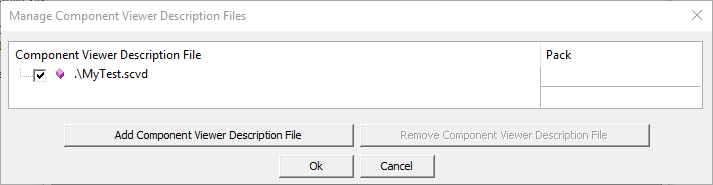

# Component Viewer {#cmp_viewer}

##  Overview {#about_cmp_viewer}

The \cviewer reads specific memory locations from the target hardware using a standard debug unit that is connected via JTAG or SWD to the CoreSight Debug Access Port (DAP). The address of these memory locations is typically defined by symbols that represent variables, arrays, or starting point of linked lists. The *.SCVD file specifies these symbols and customizes the formatting in the \cviewer window of the debugger.


\ref cv_use provides instructions on how to enable Component Viewer in a project.

**Benefits of the Component Viewer:**

 - Visibility to the static user relevant information of an software component or application program with no additional software overhead in the target application.
 - The information is obtained via debug symbols from target memory using simple read commands via JTAG or SWD connectivity to a debug adapter.
 - Debug adapters that support hot plugging allow to show the current status of the application software in case of failures.

## Component Viewer Usage Example {#cv_use}

The following steps enable views for static information of software components in the µVision debugger. Other tools might use different ways to accomplish this.

**For User Code:**

 1. Create an \ref SCVD_Format "SCVD file" to display \ref cv_static_information.
 2. Add the SCVD file to µVision as described in \manscvd.
 3. Use the µVision debugger windows as described in \cviewer.

**For Pre-annotated software components:**

The software packs for MDK-Middleware, CMSIS, and CMSIS-FreeRTOS already contain the relevant *.SCVD files.

 - Add the SCVD file of the desired software component to µVision as described in \manscvd.
 - Use the µVision debugger windows as described in \cviewer.

For examples on how to write SCVD files, refer to the \ref ExampleProjects section.

### Static Component Information {#cv_static_information}

The \ref SCVD_Format "*.SCVD file" can be used to format static information of the application using the \ref elem_objects.

Example code that is stored in the file **MyTest.c** (the file name is important for static variables).

```c
static int some_error = 1;
char string[10] = "MyTest";
```

The following **MyTest.scvd** file reads static program information from the variables in the above code snippet:

```xml
<?xml version="1.0" encoding="utf-8"?>

<component_viewer schemaVersion="0.1" xmlns:xs="http://www.w3.org/2001/XMLSchema-instance" xs:noNamespaceSchemaLocation="Component_Viewer.xsd">
  <component name="MyExample" version="1.0.0"/>    <!-- name and version of the component  -->
  
  <objects>
    <object name="MyProgram">
      <read name="error_val"   type="int32_t" symbol="MyTest.c/some_error"   />
      <read name="string_val"  type="int8_t"  symbol="string"  size="10"     />
      <out name="MyProgram">
        <item property="some_error" value="%d[error_val]" /> 
        <item property="string"     value="%t[string_val]" /> 
      </out>
    </object>
  </objects>

</component_viewer>
```

**Adding the file in the µVision debugger**

In the µVision debugger, this \ref SCVD_Format "*.SCVD file" is specified in the dialog **Options for Target -> Debug -> Manage Component Viewer Description Files**. Click on **Add Component Viewer Description File** and add the related *.SCVD file.



Using the SCVD file, µVision debugger shows static information about the program. The related view opens with **View - Watch Windows - MyProgram**.


