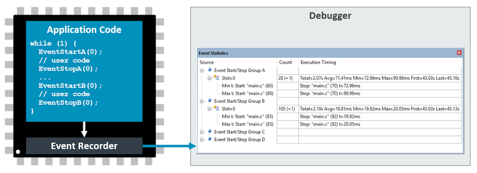
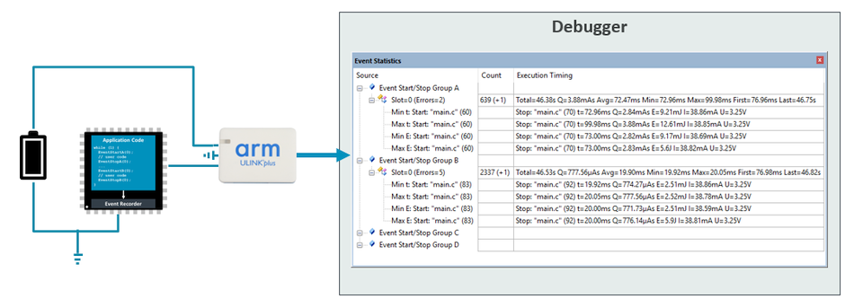
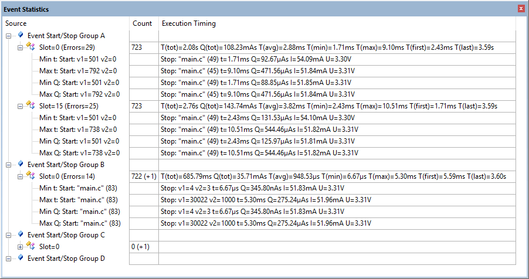

# Event Statistics {#ev_stat}

## Overview {#about_event_statistics}

The \ref Event_Execution_Statistic functions allow you to collect and statistical data about the code execution. Any debug adapter can be used to record execution timing and number of calls for annotated code sections:

Energy profiling is of annotated code sections is possible using [ULINKplus](https://developer.arm.com/Tools%20and%20Software/ULINKplus). When combined with power measurement, the Event Statistics window displays the energy consumption of the code section with min/man/average values:

For more information, refer to the \ref scvd_evt_stat example.

**Benefits of Event Statistics:**

 - Collect statistical data about the code execution (time and energy).
 - Log files enable comparisons between different build runs in continuous integration (CI) environments.
 - Improve overall code quality and energy profile (especially relevant for battery driven applications).

## Display current consumption{#es_display_energy}

Using a ULINKplus debug adapter, you can also record and analyze the energy that has been consumed in each execution slot. Using the above example on a hardware target with a ULINKplus, you get the
following display in the \estatistics window of µVision (the \erecorder window does not change):

