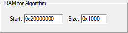
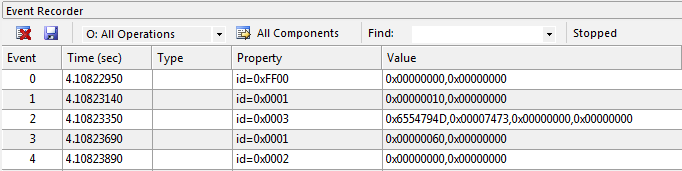
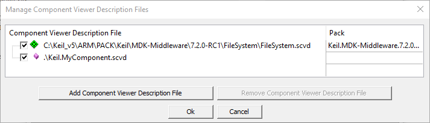
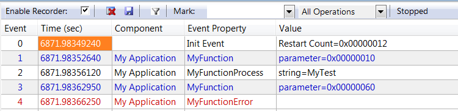

# Event Recorder {#evr}

## Overview {#about_evr}

The software component **Event Recorder** provides \ref Ref_EventRecorder "API functions" for event annotations in the application code or software component libraries. These API functions record event timing and data information while the program is executing.

The Event Filter which is controlled from the target application or the debugger allows to specify the event ids that are stored in the **event buffer** that is located in the memory of the target system. This **event buffer** may be continuously read by the debug unit and displayed in the **Event Recorder** window of the debugger.

During program execution, the debugger reads the content of the **event buffer** using a standard debug unit that is connected via JTAG or SWD to the CoreSight Debug Access Port (DAP). The **Event Recorder** requires no trace hardware and can be therefore used on any Cortex-M processor.


 - \subpage er_theory explains in details how the Event Recorder collects event data, generates time stamps, and transfers this information via a debug unit to a host computer.
 - \subpage er_use provides instructions on how to enable Event Recorder in a project.

## Features and Benefits {#evr_benefits}

 - Provides visibility to the dynamic execution of an application at little (memory) cost.
 - Works on all Cortex-M devices with JTAG or SWD debug ports.
 - Adds RTOS awareness to a development tool without complex DLL programming.
 - \ref printf_redirect "printf re-targeting" for devices without ITM, such as Arm Cortex-M0/M0+/M23.
 - Fast time-deterministic execution of event recorder functions with minimal code and timing overhead.
 - For Arm Cortex-M3/M4/M7/M33/M55/M85 processor based devices, Event Recorder functions will not disable interrupts.
 - No need for a debug or release build as the event annotations can remain in production code.
 - Collecting the data from the on-chip memory is done using simple read commands.
 - Using the DWT Cycle Count register for creating time stamps reduces code overhead (available on Arm Cortex-M3/M4/M7/M33/M55/M85).

\page er_theory Theory of operation

This section describes how the **Event Recorder** collects event data, generates time stamps, and transfers this information via a debug unit to a host computer.

The **Event Recorder** is implemented in the target application using the software component
**CMSIS-View:Event Recorder** which adds the source file *EventRecorder.c* to the application. Each event is stored in a 16-byte structure that is composed of a 16-bit *id*, 32-bit time stamp, two 32-bit data values and consistency check values.

To store these events, a circular buffer is provided that can store a minimum of 8 events. The size of this circular buffer is configurable with the `#define EVENT_RECORD_COUNT`.

## Event id {#event_id}

The \ref EventRecorder_Data functions get a parameter `id` that is composed of *level*, *component number*, and *message number* as shown below:

| *id*               | bits   | Description
|--------------------|--------|----------------------------------------------------
| *message number*   |  0..7  | identifies the event message information of the software component
| *component number* |  8..15 | identifies the software component (also used for filtering, see table below)
| *level*            | 16..17 | specifies the class of the message for filtering (see table below)
| --- (reserved)     | 18..31 | set to 0

The *level* specifies the category of the event message and can be used for filtering:

| *level*                    | Message relates to ...
|----------------------------|----------------------------------------------------
| \ref EventLevelError = 0   | Run-time error
| \ref EventLevelAPI = 1     | API function call
| \ref EventLevelOp = 2      | Internal operation
| \ref EventLevelDetail = 3  | Additional detailed information of operations

The *component number* specifies the software component that the event message belongs to and can be also used for filtering:

| *component number*        | Relation to software components
|---------------------------|----------------------------------------------------
| 0x0  .. 0x3F (0 .. 63)    | software components of the user application
| 0x40 .. 0x7F (64 .. 127)  | third party middleware components
| 0x80 .. 0xED (128 .. 237) | MDK-Middleware components
| 0xEE (238)                | Fault component
| 0xEF (239)                | Start/Stop events for Event Statistic information
| 0xF0 .. 0xFC (240 .. 253) | RTOS kernel
| 0xFD (253)                | Inter-process communication layer (multiprocessor systems)
| 0xFE (254)                | printf-style debug outputs
| 0xFF (255)                | Event Recorder messages

The following sections describe:

 - \ref er_config : explains the set-up of the Event Recorder and the configuration of a user provided timer.
 - \ref er_filtering : shows how to limit the amount of data that is displayed in the Event Recorder window.
 - \ref er_req : lists the technical data and explains the hardware and software requirements.

## Configuration {#er_config}

Adding the software component **CMSIS-View:Event Recorder** to a project will copy the file *EventRecorderConf.h* into the project that is used to define the configuration parameters of the **Event Recorder**. It uses [Configuration Wizard Annotations](https://open-cmsis-pack.github.io/Open-CMSIS-Pack-Spec/main/html/configWizard.html), so 
IDEs that support this can also show a graphical representation of the file:


Following configuration parameters are defined in the *EventRecorderConf.h* file:

|Option                              |\#define                 |Description
|------------------------------------|-------------------------|-----------
|Number of Records                   |`EVENT_RECORD_COUNT`     |Specifies the number or records stored in the Event Record Buffer. Each record is 16 bytes.
|Time Stamp Source                   |`EVENT_TIMESTAMP_SOURCE` |Specifies the timer that is used as time base. Refer to \ref TimeStampSource below for more information.
|Time Stamp Clock Frequency [Hz]     |`EVENT_TIMESTAMP_FREQ`   |Specifies the initial timer clock frequency.

> **Note**
> - Set the time stamp clock frequency to your target's core clock frequency to avoid problems in determining the correct frequency.

### Time stamp source {#TimeStampSource}

The following time stamp sources can be selected:
| Source                     | Description |
|----------------------------|-------------|
| DWT Cycle Counter          | Default setting. The DWT cycle counter is part of the CoreSight debug interface. DWT is not available with Cortex-M0/M0+/M23. \ref simulation "uVision can simulate DWT using a script". |
| SysTick                    | System tick timer is available on most Cortex-M processors. But in power-down modes it might be disabled. |
| CMSIS-RTOS2 System Timer   | The system tick counter provided by a CMSIS-RTOS2 compliant real-time operating system. |
| User Timer (Normal Reset)  | User-defined timer that stops by any system reset. Refer to \ref EventRecorder_Time for more information. |
| User Timer (Power-On Reset)| User-defined timer that stops only by power-on reset. Refer to \ref EventRecorder_Time for more information. |

> **Note**
> - When **DWT Cycle Counter** is selected on Cortex-M0/M0+/M23, a warning is issued at compile time:
>  ```
>  Invalid Time Stamp Source selected in EventRecorderConf.h!
>  ```
> - When using the **CMSIS-RTOS2 System Timer**, it is strongly recommended to set up the **Time Stamp Clock Frequency [Hz]** (see above) to the correct value to avoid display problems in the Event Recorder and System Analyzer windows.

### Configure for targets without DWT Cycle Counter {#noDWT}

Arm Cortex-M0/M0+/M23 processors do not offer the DWT Cycle Counter and require therefore alternative time-stamp sources.

**SysTick**

For applications that do not use the SysTick timer, you may configure EventRecorderConf.h with:

```c
#define EVENT_TIMESTAMP_SOURCE  1             // use SysTick
#define EVENT_TIMESTAMP_FREQ    25000000U     // processor core clock (input frequency to SysTick)
```

**CMSIS-RTOS2 System Timer**

For applications that use a CMSIS-RTOS2 compliant RTOS (SysTick timer used by RTOS), you may configure EventRecorderConf.h with:

```
#define EVENT_TIMESTAMP_SOURCE  2             // use CMSIS-RTOS2 System Timer
#define EVENT_TIMESTAMP_FREQ    25000000U     // processor core clock (input frequency to SysTick)
```

### DWT Cycle Counter with µVision simulator {#simulation}

The DWT Cycle Counter can be simulated with the following debug initialization file, for example Debug_Sim.ini:

```
MAP 0xE0001000, 0xE0001007 READ WRITE

signal void DWT_CYCCNT (void) {
  while (1) {
    rwatch(0xE0001004);
    _WWORD(0xE0001004, states);
  }
}

DWT_CYCCNT()
```

## Resource requirements {#er_req}

**Technical data of Event Recorder firmware**

Target: Cortex-M3 using DWT cycle counter as timer

|Parameter                         | ARMCC V6.13.1 | ARMCC V6.13.1
|:---------------------------------|---------------|--------------
|Compiler options                  | -Os           | -O3
|ROM size                          | < 1.7k bytes  | < 3.4k bytes
|RAM size @8 records (min)         | 292 bytes     | 292 bytes
|RAM size @64 records (default)    | 1188 bytes    | 1188 bytes
|\ref EventRecord2 (id+8bytes)     | 197 cycles    | 184 cycles
|\ref EventRecord4 (id+16bytes)    | 343 cycles    | 319 cycles
|\ref EventRecordData (id+8bytes)  | 276 cycles    | 252 cycles
|\ref EventRecordData (id+16bytes) | 425 cycles    | 397 cycles
|\ref EventRecordData (id+24bytes) | 554 cycles    | 519 cycles
|\ref EventRecordData (id+32bytes) | 685 cycles    | 643 cycles

> **Note**
> - ROM size is specified for image with all Event Recorder functions being used.
> - RAM size can be calculated as `164 + 16 * <Number of Records> (defined by EVENT_RECORD_COUNT in EventRecorderConf.h)`.
> - Timing was measured in simulator (zero cycle memory, no interrupts). Function parameter in application is not considered.

**Usage of records by Event Recorder functions**

|Function                          | Number of Records used
|:---------------------------------|-----------------------------
|\ref EventRecord2                 | 1
|\ref EventRecord4                 | 2
|\ref EventRecordData              | (event data length + 7) / 8


\page er_use Using Event Recorder

> **Note**
> - The following steps explain how to enable views for static information \a and dynamic events in the µVision debugger. Other tools might use different ways to accomplish this.

**For User Code:**

 1. \ref Add_Event_Recorder.
 2. [Optional] \ref place_uninit_memory "Locate the Event Recorder data to uninitialized memory" to avoid overwriting the entries on program reset.
 3. [Optional] Set the correct \ref initial_timestamp "initial time stamp".
 4. [Optional] Create a \ref heartbeat "heartbeat" to avoid timer overflow problems.
 5. Add \ref Event_Annotations in the C source to be able to stream dynamic event information.
 6. Create an \ref SCVD_Format "SCVD file" to \ref Format_Event_Information that matches with application code.

**For Pre-annotated Software Components:**

The software packs for MDK-Middleware, CMSIS, CMSIS-FreeRTOS already contain the relevant *.SCVD files and the related event annotations in the C source code.

 1. \ref Add_Event_Recorder to the project.
 2. Select a \ref Debug_Variants "Debug" variant for the middleware component to enable event information (for RTX5 select **Source** variant).

## Add Event Recorder Component {#Add_Event_Recorder}

To use the Event Recorder in an application, you need to:

 - Select the software component **CMSIS-View:Event Recorder** using the RTE management dialog.<br/>
    
    \note Usually, you select the **DAP** variant. If you are using a simulation model (FastModel or Arm Virtual Hardware), you can select \ref er_semihosting to write the Event Recorder data into a file on the PC.
 - Include the *EventRecorder.h* header file and add the event recorder initialization function to the source code:

```c
    :
  #include "EventRecorder.h"                        // ARM::CMSIS-View:Event Recorder
    :
  int main (void) {
    :
    HAL_Init();                                     // configure hardware abstraction layer
    SystemClock_Config();                           // configure system clock
    MemoryBus_Config();                             // configure external memory bus
    EventRecorderInitialize (EventRecordAll, 1);    // initialize and start Event Recorder
    :
    // other application code
  }
```

> **Note**
> - By default, the Event Recorder uses the DWT Cycle Counter as a time stamp source. This is not available on Cortex-M0/M0+/M23. Change the \ref er_config "configuration" to use an alternative timer instead.
> - For Keil RTX5 (version 5.4.0 and above), no call to \ref EventRecorderInitialize is required. Instead enable **Event Recorder Configuration - Global Initialization** in the RTX_Config.h file. Refer to the [CMSIS-RTX Event Recorder Configuration](https://arm-software.github.io/CMSIS-RTX/latest/config_rtx5.html#evtrecConfig) for more information.

## Locate Event Recorder in uninitialized memory {#place_uninit_memory}

For uninterrupted recording of program resets, the RAM for the Event Recorder component should be placed to a memory region that is not cleared (or initialized) by a system restart (reset).

To setup this uninitialized RAM, use either \ref evr_create_mem_ls or \ref evr_create_mem_uv procedure.

> **Notes**
> - Make sure that you use normal, non-cacheable, and non-shareable memory for Event Recorder data.

### Calculate memory requirements {#evr_memory_calc}

The memory required for the Event Recorder data is calculated with the formula:

```
164 + 16 x Number_of_Records (defined by EVENT_RECORD_COUNT in EventRecorderConf.h)
```

In this example we configure `0x800` bytes (as it is easier) which can hold more than 64 records.

### Create memory region using linker script {#evr_create_mem_ls}

If the linker script does not contain provisions for uninitialized memory section then, for respective toolchain, add the necessary section like described below:

**Arm Compiler**

For the **Arm Compiler** toolchain add the following code snippet to the linker script (.sct file), in the part specifying RAM sections (usually before Heap section):

```
  RW_NOINIT <start_address> UNINIT 0x800 {
    *(.bss.noinit)
    *(.bss.noinit.*)
  }
```

> **Notes**
>  - \<start_address\> is the physical address in RAM where the section will start
>  - 0x800 is the size of the section, adjust that as necessary

**GCC**

For the **GCC** toolchain add the following code snippet to the linker script (.ld file), in the part specifying RAM sections (usually before Heap section):

```
  .noinit (NOLOAD) :
  {
    . = ALIGN(4);
    __noinit_start = .;
    *(.noinit)
    *(.noinit.*)
    . = ALIGN(4);
    __noinit_end = .;
  } > RAM
```

> **Note**
> - The code snippet above expects defined RAM memory region, if RAM region is not defined then adapt the script accordingly.

### Create memory region using µVision {#evr_create_mem_uv}

To setup this uninitialized RAM in the µVision, follow the steps below:

1. In the **Options for Target** dialog, on the **Utilities** tab, click on **Settings** for "Use Target Driver for Flash Programming". Note the "RAM for Algorithm" area:<br/>
   

2. In the **Options for Target** dialog, define a Read/Write memory area that is not initialized and which does not overlap with the area from the first step.<br/>
For example, split IRAM1 into two regions. Reduce size of IRAM1 by 0x800 and create an IRAM2 area with start 0x2001F800 and size 0x800. Enable **NoInit** for this IRAM2 region.<br/>
   

3. In the **Options for Component Class 'CMSIS-View'** dialog (opens with right-click on **EventRecorder.c** in the **Project** window), on the **Memory** tab, assign **Zero Initialized Data** to the IRAM2 region.
    

4. Build the application to place the Event Recorder data buffers to uninitialized RAM. You may verify the generated scatter
   file:
    ```
    ; *************************************************************
    ; *** Scatter-Loading Description File generated by uVision ***
    ; *************************************************************

    LR_IROM1 0x00000000 0x00040000  {    ; load region size_region
      ER_IROM1 0x00000000 0x00040000  {  ; load address = execution address
       *.o (RESET, +First)
       *(InRoot$$Sections)
       .ANY (+RO)
      }
      RW_IRAM1 0x20000000 0x0001F800  {  ; RW data
       .ANY (+RW +ZI)
      }
      RW_IRAM2 0x2001F800 UNINIT 0x00000800  {
        EventRecorder.o (+ZI)
      }
    }
    ```

> **Note**
> - If the Event Recorder data buffer is not in uninitialized memory, the **Command** window of the debugger displays:
>   ```
>   Warning: Event Recorder not located in uninitialized memory!".
>   ```
> - [Knowledgebase article 4012](https://developer.arm.com/documentation/ka003868/latest) explains how to create custom memory areas in Keil uVision.
> - If your RAM is not big enough to separate the Event Recorder area from the Flash programming area, make sure that you enable "Reset and Run" for the **Download Function**:
  
> - If this still produces broken Event Recorder records after a reset, a power-cycle of the target system will help.


## Time Stamp Settings {#initial_timestamp}

To avoid display problems in System Analyzer, set the **Time Stamp Clock Frequency [Hz]** to the initially expected value:


## Event Recorder heartbeat {#heartbeat}

The Event Recorder timer is a 32-bit counter that can overflow. To avoid overflow problems, send a "heartbeat" event within the limits of this 32-bit counter.

**Calculation Example**

Assuming that your application is running at 168 MHz, you can calculate the time between two heartbeats like the following:

```
2^32 / 168000000 Hz = 25.57 s
```

So you need to generate an event every 25 s. This can be an event with an event ID that you don't need and thus filter from the display in Event Recorder or an event that you use to check if your application is still running.

## Event Annotations {#Event_Annotations}

To to stream dynamic event information, insert calls to the \ref EventRecorder_Data functions on relevant code locations:

 - \ref EventRecordData to record a data field with flexible length.
 - \ref EventRecord2 to record up to two 32-bit integer values.
 - \ref EventRecord4 to record up to four 32-bit integer values.

These \ref EventRecorder_Data functions receive as first parameter an *id* event identifier used for filtering and displaying. The macro \ref EventID may be used to compose *id* values to include *level* and *component* numbers.

**Example:**

```c
#include "EventRecorder.h"                                   // ARM::CMSIS-View:Event Recorder

int some_error = 0;                                          // error flag
char string[10] = "MyTest";                                  // some test string

void MyFunction (int parameter) {
  EventRecord2 (1+EventLevelAPI, parameter, 0);              // Event at Start
    ;
  if (some_error)  {
    EventRecord2 (2+EventLevelError, 0, 0);                  // Event at Error
    return;
  }
  EventRecordData (3+EventLevelOp, string, sizeof(string));  // Event at Finish
  return;
}

int main (void) {
  EventRecorderInitialize (EventRecordAll, 1);               // initialize and start Event Recorder

  MyFunction (0x10);
  some_error = 1;                                            // set error flag
  MyFunction (0x60);
}
```

When executing this example in the µVision debugger, use the menu command **View - Analysis Windows - Event Recorder** to open the Event Recorder window. This should show the following output:



## Format Event Information {#Format_Event_Information}

You may create an \ref SCVD_Format "*.SCVD (Software Component View Description) file"  to format the event output so that matches the application. The event output is created using the \ref elem_events.

**SCVD file example**

```xml
<?xml version="1.0" encoding="utf-8"?>

<component_viewer schemaVersion="0.1" xmlns:xs="http://www.w3.org/2001/XMLSchema-instance" xs:noNamespaceSchemaLocation="Component_Viewer.xsd">
  <component name="MyExample" version="1.0.0"/>    <!-- name and version of the component  -->

    <events>
      <group name="My Events Group">
         <component name="MyApp"      brief="My Application"    no="0x00" prefix="EvrNetMM_"    info="Network - System - Dynamic Memory Management"/>
      </group>

      <event id="1" level="API"   property="MyFunction"        value="parameter=%x[val1]"     info="Event on start of MyFunction"  />
      <event id="2" level="Error" property="MyFunctionError"                                  info="Event on error in MyFunction" />
      <event id="3" level="Op"    property="MyFunctionProcess" value="string=%t[val1]"        info="Event on operation in MyFunction"  />
    </events>

</component_viewer>
```

In the µVision debugger, this \ref SCVD_Format "*.SCVD file" is specified in the dialog **Options for Target - Debug - Manage Component Viewer Description Files**. Click on **Add Component Viewer Description File** and add the related *.SCVD file.



The Event Recorder displays the events as shown below.



The described groups and events also show up in the filter dialog.


## Software Component Variants {#Debug_Variants}

The software packs for MDK-Middleware and CMSIS already contain SCVD files that match the related event annotations in the C
source code. However, you need to select the right component **Variant**. For MDK-Middleware, you need to select
the **Debug** variants, whereas for Keil RTX5, you need to add the **Source** variant.

The example below enables event recording for the MDK-Middleware **File System** component:


## Redirecting printf output {#printf_redirect}

The Event Recorder can be used to retarget printf output. This is especially interesting for targets without ITM, such as Cortex-M0/M0+/M23. Steps to enable this:

 1. In the Manage Run-Time Environment window, select the component **CMSIS-Compiler:STDOUT:Event Recorder**.
 2. Select the component **CMSIS-View:Event Recorder** or use the **Resolve** button.
 3. In the user code, include *EventRecorder.h* and call the `EventRecorderInitialize()` function in `main()`.

Also see [CMSIS-Compiler documentation](https://arm-software.github.io/CMSIS-Compiler/latest/index.html) for addition details about printf redirecting.

## Event filtering {#er_filtering}

Filtering for events reduces the amount of data transmitted from the target to the debugger. To filter for events, use the button **Configure Target Event Recording**:


A new window opens up that lets you filter for events that you are interested in:


## Semihosting {#er_semihosting}

Semihosting is a mechanism that enables code running on an Arm target to communicate and use the input/output facilities on a host computer that is running a debugger.

Examples of these facilities include keyboard input, screen output, and disk I/O. For example, you can use this mechanism to enable functions in the C library, such as `printf` and `scanf`, to use the screen and keyboard of the host instead of having a screen and keyboard on the target system.

With the Event Recorder, you can use semihosting with models to write the events into a file on your PC. This works with [Arm
Fast Models](https://developer.arm.com/Tools%20and%20Software/Fast%20Models), [Arm Fixed Virtual Platforms](https://developer.arm.com/Tools%20and%20Software/Fixed%20Virtual%20Platforms), and [Arm Virtual Hardware](https://www.arm.com/products/development-tools/simulation/virtual-hardware) alike.

The file that is written is called `EventRecorder.log` and is a binary file that is available in the root directory of your project. Use \ref evntlst to read and decode the binary data.

> **Note**
> - Your model needs to be configured for semihosting (refer to the documentation of your modeling technology on how to do that).
> - You can specify a different name for the log file by specifying a define called `EVENT_LOG_FILENAME`.
> - In µVision, once you start a new debug session, the log file will be overwritten. While in debug, new messages will be appended to the currently open log file.
> - In µVision, the semihosting variant will not work with real target hardware. Instead, program execution will hit a breakpoint and stop there.
> - In µVision, you can still use the Event Recorder window in µVision to see the events coming in while the file is written to the hard drive of your PC.
