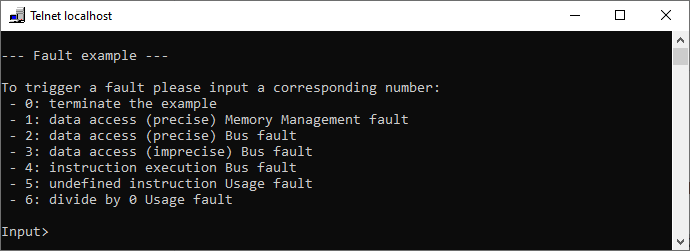
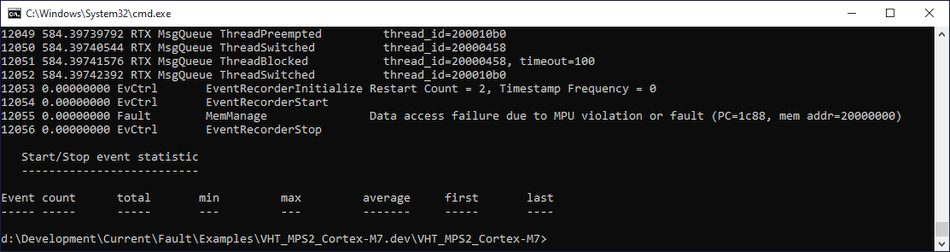
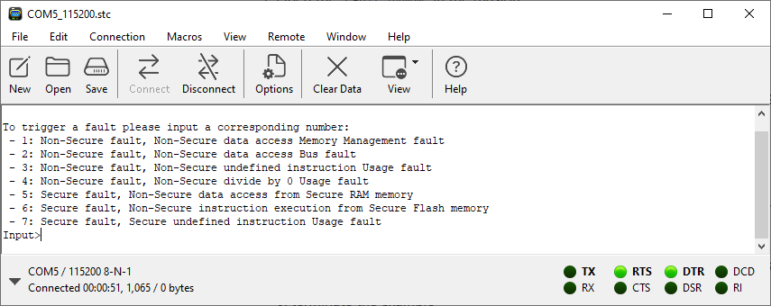
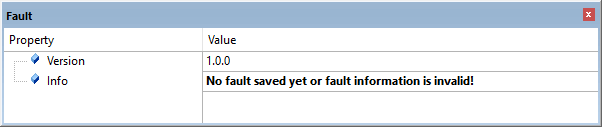
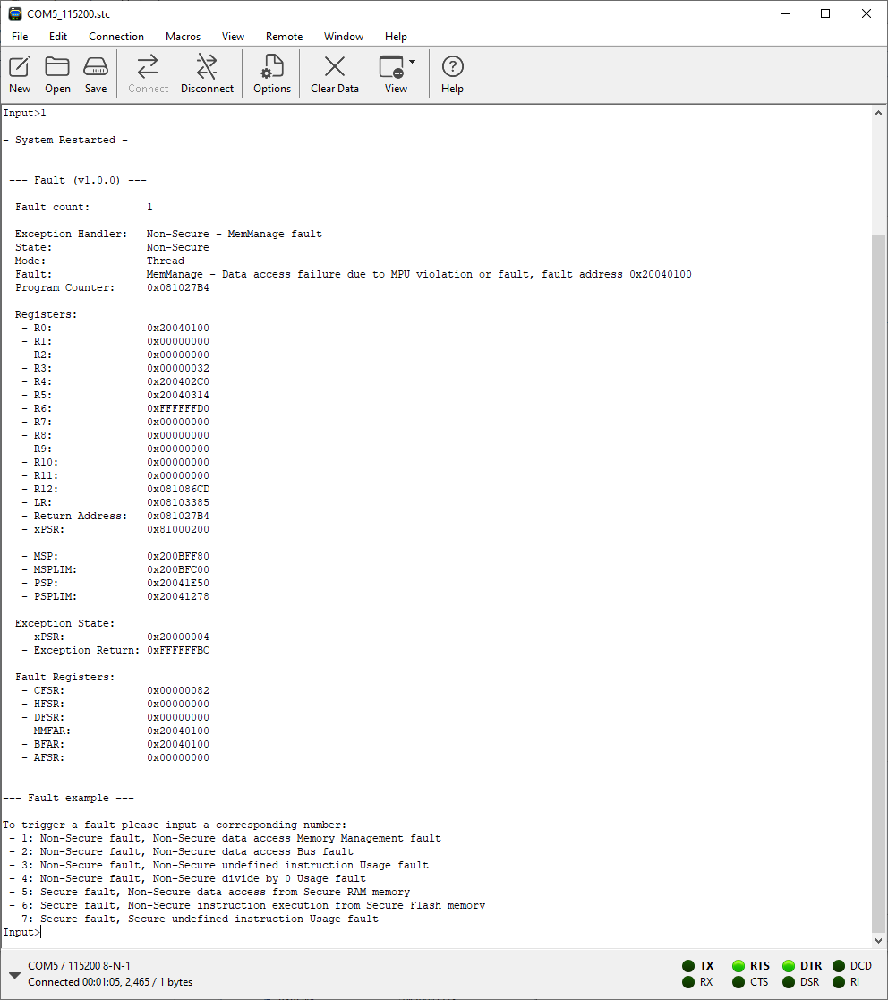

# Examples {#ExampleProjects}

These examples show the usage of the \subpage er_examples and \subpage flt_examples.

\page er_examples Event Recorder

This example shows you how to utilize Event Recorder in own application software.

This example project is based on an Arm Cortex-M processor and uses the [**CMSIS-Toolbox**](https://github.com/Open-CMSIS-Pack/cmsis-toolbox) for project build, and runs on [**Arm Virtual Hardware**](https://arm-software.github.io/AVH/main/overview/html/index.html) processor simulation.

Example Project                                | Description
:----------------------------------------------|:-----------------------------------------
\subpage scvd_evt_stat "SCVD Event Statistics" | Shows the usage of start/stop events for statistical code profiling.

\page flt_examples Fault component

These examples show you how to utilize Fault component in own application software. 

Example Project                                | Description
:----------------------------------------------|:-----------------------------------------
\subpage flt_example_CM7 "VHT_MPS2_Cortex-M7"  | Shows the usage of Fault component on an Cortex-M7. This example runs on [**Arm Virtual Hardware**](https://arm-software.github.io/AVH/main/overview/html/index.html) processor simulation.
\subpage flt_example_CM33 "B-U585I-IOT02A"     | Shows the usage of Fault component on an Cortex-M33 with TrustZone. This example runs on STMicroelectronics [**B-U585I-IOT02A**](https://www.st.com/en/evaluation-tools/b-u585i-iot02a.html) evaluation board.


\page scvd_evt_stat Event Statistics

This example project shows how to use start/stop events with the Event Recorder.

The start/stop events allow to measure execution times with different slots (0 - 15) in four different groups (A - D). The call to 'EventStart' starts a timer slot; the call to 'EventStop' stops the related timer.  A call to EventStop with slot 15 stops the timers of all slots in the specific group.

This demo application does some time consuming calculations that are recorded. It runs in simulation and does not require any hardware to be present.

**main.c File**

```c
#include "RTE_Components.h"             // Component selection
#include CMSIS_device_header            // defined in the RTE_Components.h file

#include "EventRecorder.h"

#include <math.h>
#include <stdio.h>
#include <stdlib.h>

#define TABLE_SIZE 1000
float sin_table[TABLE_SIZE];

// Calculate table with sine values
void CalcSinTable (void)  {
  unsigned int i, max_i;
  float f = 0.0;

  max_i = TABLE_SIZE - (rand () % 500);
  EventStartAv (15, max_i, 0);                  // Start group A, slot 15, passing the max_i variable
  for (i = 0; i < max_i; i++)  {
    if (i == 200)  {
       EventStartAv (0, max_i, 0);              // Start group A, slot 0, passing the max_i variable
    }

    sin_table[i] = sinf(f);
    f = f + (3.141592 / TABLE_SIZE);

    if (i == 800)  {                            // Measure 800 table entries
      EventStopA (0);                           // Stop group A, slot 0
    }
  }

   EventStopA (15);                              // Stop group A, slot 15 (stops also slots 0..14)
}

// Return number of sqrt operations to exceed sum
unsigned int FindSqrtSum (float max_sum)  {
  unsigned int i;
  float sqrt_sum;

  sqrt_sum = 0.0;
  for (i = 0; i < 10000; i++) {
    sqrt_sum += sqrtf((float) i);
    if (sqrt_sum > max_sum)  {
      return (i);
    }
  }
  return (i);
}

unsigned int j, num, MaxSqrtSum;


int main (void) {

  SystemCoreClockUpdate();                      // System Initialization

  EventRecorderInitialize (EventRecordAll, 1U); // Initialize and start Event Recorder
  EventRecorderClockUpdate();
  EventStartC (0);                              // start measurement event group C, slot 0
  printf ("Started\n");
  for (j = 0; j < 10000; j++)  {
    CalcSinTable ();                            // calculate table with sinus values

    EventStartB(0);                             // start group B, slot 0
    MaxSqrtSum = rand () / 65536;               // limit for sqrt calculation
    num = FindSqrtSum ((float) MaxSqrtSum);     // return number of sqrt operations
    EventStopBv(0, MaxSqrtSum, num);            // stop group B, slot 0, output values: MaxSqrtSum, num
  }

  EventStopC(0);                                // stop measurement event group C, slot 0

  while (1) {
        __NOP();
  }
}
```

**Build and run**

This example project does not require an IDE and can be built using the [CMSIS-Toolbox](https://github.com/Open-CMSIS-Pack/cmsis-toolbox).

Clone this repository or download it as a ZIP file onto your computer. Follow the instructions in the `README.md` file to build and run the project. Use the \ref evntlst application to analyze the outcomes.


\page flt_example_CM7 VHT_MPS2_Cortex-M7

This example project shows **Exception Fault Analysis** using **Arm Cortex-M7** simulated by [**Arm Virtual Hardware**](https://arm-software.github.io/AVH/main/simulation/html/Using.html) with the **VHT_MPS2_Cortex-M7** model simulator.

**Build and run**

This example project does not require an IDE and can be built using the [**CMSIS-Toolbox**](https://github.com/Open-CMSIS-Pack/cmsis-toolbox).

Clone this repository or download it as a ZIP file onto your computer. Follow the instructions in the \subpage flt_example_CM7_readme "README.md" file to build and run the project.

**Screenshots**

User Interface:



**EventRecorder.log** containing saved Memory Management fault information, processed with **eventlist** utility:




\page flt_example_CM33 B-U585I-IOT02A

This example project shows **Exception Fault Analysis** using **Arm Cortex-M33** running on a STMicroelectronics [**B-U585I-IOT02A**](https://www.st.com/en/evaluation-tools/b-u585i-iot02a.html) evaluation board.

**Build and run**

This example project requires the [**Keil MDK**](https://developer.arm.com/Tools%20and%20Software/Keil%20MDK).

Clone this repository or download it as a ZIP file onto your computer. Follow the instructions in the \subpage flt_example_CM33_readme "README.md" file to build and run the project.

**Screenshots**

User Interface:



**Component View** when no fault was saved yet:



**Component View** when Memory Management fault has occurred:


**Event Recorder** messages when Memory Management fault was decoded and output to Event Recorder:


**Serial Terminal** output when Memory Management fault was decoded and output to STDIO:


