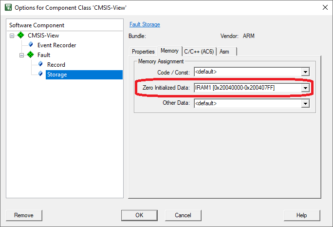

# Fault Analysis {#fault}

## Overview {#about_fault}

The software components **CMSIS-View:Fault** provide infrastructure and \ref Ref_Fault "API function calls" to store, record, and analyze the Cortex-M Exception Fault information.

Arm Cortex-M processors raise an exception fault on critical system failures such as illegal memory write or read, access to an disabled peripheral, execution of an invalid instruction, or division by zero:

 - The component **CMSIS-View:Fault:Storage** can be used to save an exception fault information for later analysis.
 - The component **CMSIS-View:Fault:Record** decodes a saved exception fault information and records this information using the **Event Recorder**.

A typical execution flow is shown in the diagram below.


 - \subpage flt_theory explains in details how the Fault component stores fault information and how it can be used for further analysis.
 - \subpage flt_use provides instructions on how to enable Fault component in a project.

An application note is available that describes the Cortex-M fault exceptions from the programmers view and explains their usage during the software development cycle: [KAN209 - Using Cortex-M3/M4/M7 Fault Exceptions](https://developer.arm.com/documentation/kan209/latest).

\page flt_theory Theory of operation

This section describes how the **Fault** component operates and how the fault information can be analyzed.

The **Fault** component is implemented in the target application using the software component **CMSIS-View:Fault:Storage** which adds the source file *ARM_FaultStorage.c* to the application.

This source file provides an \ref ARM_FaultSave function which is used to save the fault information into an uninitialized part of the RAM which can then be analyzed on-chip, or on a host computer using a debugger. When using semihosting, cloud storage, or another remote location for storing the log file, you can do post-processing using \ref evntlst.

## Fault information storage

Fault information is stored in an \ref ARM_FaultInfo structure, residing in uninitialized RAM memory, when the \ref ARM_FaultSave function is executed from an exception handler.

## Fault information analysis

To see and analyze the details of a fault, there are the following options:

 - Fault information can be decoded and written to the Event Recorder by calling the function \ref ARM_FaultRecord (Event Recorder has to be operational). This is an exemplary output in µVision:  
   
 - Fault information can be decoded and written to the standard output by calling the function \ref ARM_FaultPrint (this function is implemented in a user template and can be changed by the user):  
   
 - Fault information can be inspected in a debug session by viewing it in the Component Viewer (screenshot showing µVision):  
   

## Resource requirements {#flt_req}

This section contains the the technical data of the Fault component firmware.

**RAM:**

The Fault component uses the \ref ARM_FaultInfo structure to save information when the fault occurs. The size depends on the Arm Cortex-M core for which the code was compiled:

 - If the Arm Cortex-M core contains Fault Registers (e.g. Cortex-M33), the \ref ARM_FaultInfo structure requires **140 bytes** of uninitialized RAM memory.
 - If the Arm Cortex-M core does not contain Fault Registers (e.g. Cortex-M0), the \ref ARM_FaultInfo structure requires **104 bytes** of uninitialized RAM memory.

**ROM:**

The functions of the Fault component require the following amounts of ROM memory:

 - The\ref ARM_FaultSave function requires up to **0.5 KB** of ROM memory.
 - The \ref ARM_FaultRecord function requires approximately up to **1.5 KB** of ROM memory.
 - The \ref ARM_FaultPrint function requires approximately up to **2.5 KB** of ROM memory.

\page flt_use Using Fault component

The following steps explain how to enable Fault component using the µVision. Other tools might use different ways to accomplish this.

**For User Code:**

 1. \ref flt_add_component.
 2. \ref flt_place_uninit_memory "Locate fault information in uninitialized memory" to be preserved over system reset.

## Add Fault Storage (and Record) Component {#flt_add_component}

To use the Fault component in an application, you need to:

 - Select the software components **CMSIS-View:Fault:Storage**, **CMSIS-View:Fault:Record** and **CMSIS-View:Event Recorder** using the RTE management dialog.<br/>
   
 - Include the *ARM_Fault.h* header and *EventRecorder.h* header files in your source code
 - Add fault handlers that jump to \ref ARM_FaultSave function
 - Check if a fault has occurred and output fault information to Event Recorder or STDIO and analyze it, or analyze fault information in a Component Viewer window in a debug session 

**Code example:**

```c
#include "EventRecorder.h"
#include "ARM_Fault.h"

__attribute__((naked)) void HardFault_Handler (void) {
  __ASM volatile (
    "b  ARM_FaultSave\n"
  );
}

int main() {
    SystemCoreClockUpdate();                      // System core clock update

    EventRecorderInitialize (EventRecordAll, 1U); // Initialize and start Event Recorder
    EventRecorderClockUpdate();                   // Update Event Recorder timestamp clock 

    if (ARM_FaultOccurred() != 0U) {              // If fault information exists
      ARM_FaultRecord();                          // Output decoded fault information via Event Recorder
      EventRecorderStop();                        // Stop Event Recorder
    }

    // ...

    while (1) {
       __NOP();
    }
}
```

## Locate fault information in uninitialized memory {#flt_place_uninit_memory}

For preservation of the saved fault information after system reset, RAM for the \ref ARM_FaultInfo structure should be placed to a memory
region that is not cleared (or initialized) by a system restart (reset).

> **Note**
> - Make sure that you use normal, non-cacheable, and non-shareable memory for fault information data.

For size of this memory section take a look at \ref flt_req. 

To setup this uninitialized RAM, use either \ref flt_create_mem_ls or \ref flt_create_mem_uv procedure.


### Create memory region using linker script {#flt_create_mem_ls}

If the linker script does not contain provisions for uninitialized memory section then, for respective toolchain, add the necessary section like described below:

**Arm Compiler:**

For the Arm Compiler toolchain add the following code snippet to the linker script (.sct file), in the part specifying RAM sections (usually before Heap section):

```
  RW_NOINIT <start_address> UNINIT 0x800 {
    *(.bss.noinit)
    *(.bss.noinit.*)
  }
```

> **Note**
> - \<start_address\> is the physical address in RAM where the section will start.
> - 0x800 is the size of the section covering also default Event Recorder data, adjust that as necessary


**GCC:**

For the GCC toolchain add the following code snippet to the linker script (.ld file), in the part specifying RAM sections (usually before Heap section):

```
  .noinit (NOLOAD) :
  {
    . = ALIGN(4);
    __noinit_start = .;
    *(.noinit)
    *(.noinit.*)
    . = ALIGN(4);
    __noinit_end = .;
  } > RAM
```

> **Note**
> - The code snippet above expects defined RAM memory region, if RAM region is not defined then adapt the script accordingly.

### Create memory region using µVision {#flt_create_mem_uv}

To setup this uninitialized RAM in the µVision, follow the steps below:

 1. In the **Options for Target** dialog, define a Read/Write Memory Area that is not initialized, by splitting available internal RAM into 2 areas.<br/>
   For example, split IRAM1 into two regions. Reduce size of IRAM1 to 0x800 and create an IRAM2 area with remaining of the available RAM. Enable **NoInit** for the IRAM1 region.<br/>
   


 2. In the **Options for Component Class 'CMSIS-View'** dialog (opens with right-click on **ARM_FaultStorage.c** in the **Project** window), on the **Memory** tab, assign **Zero Initialized Data** to the IRAM1 region.<br/>
    

 3. Build the application to place the \ref ARM_FaultInfo structure to uninitialized RAM.
