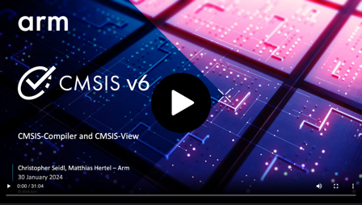

# Introduction

**CMSIS-View** provides software components and utilities that allow embedded software developers to analyze program execution flows, debug potential issues, and measure code execution times. The data can be observed in real-time in an IDE or can be saved as a log file during program execution.

CMSIS-View contains these components:

- [Event Recorder](https://arm-software.github.io/CMSIS-View/latest/evr.html) - lets you record event timing and data information while the program is executing.
- [Event Statistics](https://arm-software.github.io/CMSIS-View/latest/ev_stat.html) - allows you to collect and statistical data about the code execution.
- [eventlist utility](https://arm-software.github.io/CMSIS-View/latest/evntlst.html) - a command line tool for processing Event Recorder log files.
- [Component Viewer](https://arm-software.github.io/CMSIS-View/latest/cmp_viewer.html) - provides visibility to the user relevant static information of a software component or application program.
- [Fault](https://arm-software.github.io/CMSIS-View/latest/fault.html) - allows you to store, record, and analyze exception fault information.

For more information, please refer to:

- [Repository](https://github.com/ARM-software/CMSIS-View)
- [Documentation](https://arm-software.github.io/CMSIS-View/latest/index.html)

## CMSIS-View Introduction Webinar

Watch the [introduction webinar](https://developer.arm.com/Additional%20Resources/Video%20Tutorials/CMSIS-View%20and%20CMSIS-Compiler) to learn about CMSIS-View and how to use it.

## Related CMSIS-Packs

The following CMSIS-Packs are maintained by Arm and related to CMSIS-View.

### CMSIS Component Packs

- [CMSIS-Compiler](https://www.keil.arm.com/packs/cmsis-compiler-arm): Retarget I/O functions of the standard C run-time library.
- [CMSIS-DSP](https://www.keil.arm.com/packs/cmsis-dsp-arm/): Optimized compute functions for embedded systems.
- [CMSIS-NN](https://www.keil.arm.com/packs/cmsis-nn-arm): Efficient and performant neural network kernels.

### Real-time Operating Systems

- [CMSIS-RTX](https://www.keil.arm.com/packs/cmsis-rtx-arm): Keil RTX5, a CMSIS-RTOS2 API compliant real-time operating system.
- [CMSIS-FreeRTOS](https://github.com/ARM-software/CMSIS-FreeRTOS): CMSIS-RTOS adaptation of FreeRTOS.
- [CMSIS-RTOS2 Validation](https://github.com/arm-software/CMSIS-RTOS2_Validation): Validation suite for RTOS2 compliant implementations.

### Middleware

- [MDK-Middleware](https://www.keil.arm.com/packs/mdk-middleware-keil): File system, network, and USB stacks.
- [CMSIS-mbedTLS](https://github.com/ARM-software/CMSIS-mbedTLS): Mbed TLS framed in a CMSIS-Pack.
- [SDS-Framework](https://github.com/ARM-software/SDS-Framework): Synchronous data streaming.

### Other Software Components

- [Cortex_DFP](https://github.com/ARM-software/CMSIS-DFP): Generic Arm Cortex-M device family pack.
- [CMSIS-Driver](https://github.com/ARM-software/CMSIS-Driver): MCU peripheral driver implementations.
- [CMSIS-Driver Validation](https://github.com/ARM-software/CMSIS-Driver_Validation/): Validation suite for CMSIS-Driver implementations.
