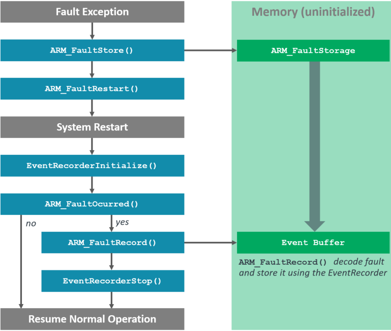

# Exception Fault Analysis {#fault}

## Overview {#about_fault}

The software components under **CMSIS-View:Fault** provide infrastructure and [API (function calls)](modules.html) to store, record, and analyze the Cortex-M Exception Fault information.
The Arm Cortex-M processors raise an exception fault on critical system failures such as illegal memory write or read, access to an disabled peripheral, execution of an invalid instruction, division by zero.
With the component **CMSIS-View:Fault:Storage** an exception fault can be saved for later analysis.  The component **CMSIS-View:Fault:Record** decodes an saved exception fault and records this information using the **Event Recorder**.

A typical execution flow is shown in the diagram below.



## Usage example

```c
#include "EventRecorder.h"
#include "ARM_Fault.h"

#include <stdlib.h>

__attribute__((naked)) void HardFault_Handler (void) {
  __ASM volatile (
    "b  ARM_FaultSave\n"
  );
}

int main() {
    SystemCoreClockUpdate();                      // System Initialization

    EventRecorderInitialize (EventRecordAll, 1U); // Initialize and start Event Recorder
    EventRecorderClockUpdate();

    if (ARM_FaultOccurred()) {
        ARM_FaultRecord();
    }

    // ...

    while (1) {
       __NOP();
    }
}
```
