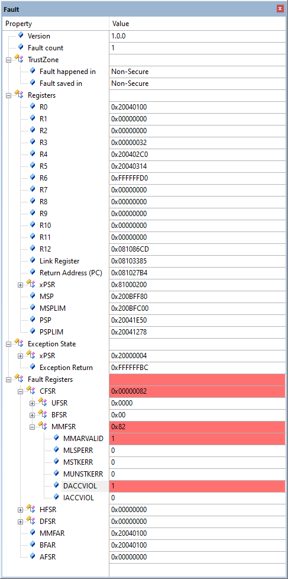
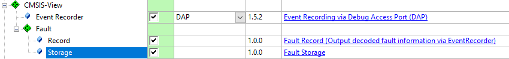

# Exception Fault Analysis {#fault}

## Overview {#about_fault}

The software components under **CMSIS-View:Fault** provide infrastructure and [API (function calls)](modules.html) to store, record, and analyze the Cortex-M Exception Fault information.
Arm Cortex-M processors raise an exception fault on critical system failures such as illegal memory write or read, access to an disabled peripheral, execution of an invalid instruction, or division by zero.

The component **CMSIS-View:Fault:Storage** can be used to save an exception fault for later analysis.

The component **CMSIS-View:Fault:Record** decodes saved exception fault information and records this information using the **Event Recorder**.

A typical execution flow is shown in the diagram below.


- \subpage flt_theory explains in details how the Fault component stores fault information and how it can be used for further analysis.
- \subpage flt_use provides instructions on how to enable Fault component in a project.

\page flt_theory Theory of operation

This section describes how the **Fault** component operates and how the fault information can be analyzed.

The **Fault** component is implemented in the target application using the software component **CMSIS-View:Fault:Storage** which adds the source file *ARM_FaultStorage.c* to the application. 
This source file provides an \ref ARM_FaultSave function which is used to save the fault information into an uninitialized RAM memory which can then be analyzed on-chip, or on a host computer
with usage of a debugger or semihosting if simulator is used, or sent to the Cloud or other remote location for post-processing.

### Fault information storage

Fault information is stored in an \ref ARM_FaultInfo structure, residing in the uninitialized RAM memory, when \ref ARM_FaultSave function is executed from exception handler.

### Fault information analysis

To see and analyze the details of a fault, there are a few options:
- Fault information can be decoded and written to the Event Recorder by calling the function \ref ARM_FaultRecord (Event Recorder has to be operational)<br/>
  
- Fault information can be decoded and written to the Standard Output by calling the function \ref ARM_FaultPrint (this function is implemented in an user template and can be changed by the user)<br/>
  
- Fault information can be inspected in a debug session by viewing it in the Component Viewer<br/>
  

## Resource requirements {#flt_req}

**Technical data of Fault component firmware**

**RAM requirement**

The Fault component uses \ref ARM_FaultInfo structure to save information when the fault occurs.

\ref ARM_FaultInfo size depends on Arm Core for which the code was compiled.

If the Arm Core contains Fault Registers (e.g. Cortex-M33) then \ref ARM_FaultInfo structure requires **144 bytes** of uninitialized RAM memory.

If the Arm Core does not contain Fault Registers (e.g. Cortex-M0) \ref ARM_FaultInfo structure requires 108 bytes of uninitialized RAM memory.

**ROM requirement**

\ref ARM_FaultSave function requires up to **0.5 KB** of ROM memory.

\ref ARM_FaultRecord function requires approximately up to **1.5 KB** of ROM memory.

\ref ARM_FaultPrint function requires approximately up to **2.5 KB** of ROM memory.

\page flt_use Using Fault component

The following steps explain how to enable Fault component using the µVision. Other tools might use different ways to accomplish this.

**For User Code:**
  -# \ref flt_add_component.
  -# \ref flt_place_uninit_memory "Locate fault information in uninitialized memory" to be preserved over system reset.

## Add Fault Storage (and Record) Component {#flt_add_component}

To use the Fault component in an application, you need to:
  - Select the software components **CMSIS-View:Fault:Storage**, **CMSIS-View:Fault:Record** and **CMSIS-View:Event Recorder** using the RTE management dialog.<br/>
    
  - Include the *ARM_Fault.h* header and *EventRecorder.h* header files in your source code
  - Add fault handlers that jump to \ref ARM_FaultSave function
  - Check if a fault has occurred and output fault information to Event Recorder or STDIO and analyze it, or analyze fault information in a Component Viewer window in a debug session 

  Code example:
```c
#include "EventRecorder.h"
#include "ARM_Fault.h"

__attribute__((naked)) void HardFault_Handler (void) {
  __ASM volatile (
    "b  ARM_FaultSave\n"
  );
}

int main() {
    SystemCoreClockUpdate();                      // System core clock update

    EventRecorderInitialize (EventRecordAll, 1U); // Initialize and start Event Recorder
    EventRecorderClockUpdate();                   // Update Event Recorder timestamp clock 

    if (ARM_FaultOccurred() != 0U) {              // If fault information exists
      ARM_FaultRecord();                          // Output decoded fault information via Event Recorder
      EventRecorderStop();                        // Stop Event Recorder
    } else {                                      // If fault information does not exist
      ARM_FaultClear();                           // Clear (initialize) fault information
    }

    // ...

    while (1) {
       __NOP();
    }
}
```

## Locate fault information in uninitialized memory {#flt_place_uninit_memory}

For preservation of the saved fault information over system reset, RAM for the \ref ARM_FaultInfo structure should be placed to a memory
region that is not cleared (or initialized) by a system restart (reset).

\note Make sure that you use normal, non-cacheable, and non-shareable memory for fault information data.

### Create memory region {#flt_create_mem}

The \ref ARM_FaultInfo structure can be located in uninitialized RAM by using µVision or by using a \ref flt_linker_script "linker script".

#### Using µVision

To setup this uninitialized RAM in the µVision, follow the steps below:

1. In the **Options for Target** dialog, define a Read/Write Memory Area that is not initialized, by splitting available internal RAM into 2 areas.<br/>
   For example, split IRAM1 into two regions. Reduce size of IRAM1 to 0x800 and create an IRAM2 area with remaining of the available RAM. Enable **NoInit** for the IRAM1 region.<br/>
   


2. In the **Options for Component Class 'CMSIS-View'** dialog (opens with right-click on **ARM_FaultStorage.c** in the **Project** window), on the **Memory** tab, assign **Zero Initialized Data** to the IRAM1 region.<br/>
    

3. Build the application to place the \ref ARM_FaultInfo structure to uninitialized RAM.

#### Using Linker Script {#flt_linker_script}

Documentation about <a href="https://developer.arm.com/documentation/101754/latest/armlink-Reference/Scatter-loading-Features" target="_blank">linker script</a>.

You can use a linker script with specifying location for <b>\.bss\.noinit</b> section as **UNINIT** section like below:

	```
    // Scatter file

    // ...

      RW_IRAM1 0x20040000 UNINIT 0x800  {
        * (.bss.noinit)
      }

    // ...
    ```

\note
- If the \ref ARM_FaultInfo structure is not located in uninitialized memory, then after system reset, any saved fault information will be cleared and thus saved fault information will be lost.
