\mainpage

**CMSIS-View** equips software developers with methodologies, software components and utilities that provide visibility into internal operation of embedded applications and software components.

With CMSIS-View developers can collect time-accurate event-based information as well as see the real-time program execution status. The data can be observed in real-time in an IDE or can be saved as a log file during program execution. It allows to analyze  execution flows, debug potential issues, and measure execution times.

Key elements of CMSIS-View are:
- \ref er_use "Event Recorder" - is an embedded software component that provides an [API (function calls)](Modules.html) for event annotations in the code.
- \ref SCVD_Format "SCVD file specification" defines the content that is displayed.

A **Software Component Viewer Description** (*.SCVD) file in \ref SCVD_Format (XML) defines the content that is displayed in the **Component Viewer** and **Event Recorder**.

In addition, using the Event Recorder API, you can annotate your
code so that you can get statistical data on the time spent in a loop or on the energy consumption
(<a href="https://www.keil.com/mdk5/ulink/ulinkplus">ULINKplus</a> required).

The debugger can load multiple *.SCVD files as typically each software component has an individual description file.

# Content {#content}

This user's guide contains the following chapters:
 - \subpage er_rev_history : lists CMSIS-View releases
 - \subpage evr : explores the features and operation of the **Event Recorder** including
   configuration, technical data, and theory of operation.
 - \subpage ev_stat : describes how to use Event Statistics to create statistical data on code execution and power consumption.
 - \subpage cmp_viewer : explains the use of Component Viewer.
 - \subpage SCVD_Format : describes the format of the Software Component View Description (*.SCVD) files that define the output of the MDK debugger views.
 - \subpage ExampleProjects are available demonstrating standard use cases.
 - **[References](Modules.html)** describes the API and the functions of the **Event Recorder** in details.

\page er_rev_history Revision History

Table below provides revision history for CMSIS-View software component.

<table>
    <tr>
      <th>Version</th>
      <th>Description</th>
    </tr>
    <tr>
      <td>V1.1.1</td>
      <td>
        Added clock frequency to internal Event Recorder Initialization message.
      </td>
    </tr>
    <tr>
      <td>V1.1.0</td>
      <td>
        Added Event Recorder logging via Semihosting.
      </td>
    </tr>
    <tr>
      <td>V1.0.0</td>
      <td>
        Open Source Version of Event Recorder Version 1.4.0 under Apache 2.0.
      </td>
    </tr>
 </table>


\page ExampleProjects Examples

The software pack <a href="https://www.keil.com/dd2/pack/#/Keil.ARM_Compiler" target="_blank"><b>Keil:ARM_Compiler</b></a> contains several example projects that show the usage of Component Viewer and Event Recorder. These example projects contain Software Component Viewer Description (*.SCVD) files. Use the \packinstaller to copy the projects to working folder. Build the selected project and enter a debug session. All projects run in simulation and do not require hardware.

These examples show you how to utilize \cviewer and \erecorder in own application software.  All example projects are based on an Arm Cortex-M processors and are configured to use processor simulation. Additional instructions have been added to the project descriptions.

The following SCVD example projects are available:

Example Project                                        | Description
:------------------------------------------------------|:-----------------------------------------
\subpage simple_scvd "SCVD Simple Example"             | Simple example that shows how to display two variables in the \cviewer.
\subpage complex_scvd "SCVD Complex Example"           | More complex \cviewer example.
\subpage MyComponent "SCVD in MyComponent"             | Example showing \cviewer and \erecorder and how to create links to documentation and include SCVD files in software packs.
\subpage scvd_evt_stat "SCVD Event Statistics"         | Example that shows the usage of start/stop events for statistical code profiling with the \estatistics window.
\subpage scvd_evt_state "SCVD Event State"             | Example that uses state information to display time-line information in the <a target="_blank" href="http://www.keil.com/support/man/docs/uv4/uv4_db_dbg_systemanalyzer.htm"><b>System Analyzer</b></a> window.
\subpage scvd_CM0_SysTick "SCVD Cortex-M0 SysTick"     | Example that shows the Event Recorder with SysTick timer as time source (for Cortex-M0/M0+/M23)
\subpage scvd_CM0_RTOS "SCVD Cortex-M0 RTOS"           | Example that shows the Event Recorder with RTOS System Timer as time source (for Cortex-M0/M0+/M23)


\page simple_scvd SCVD Simple Example

If you just want to display execution status information, you only require \cviewer. Use the example project **Simple SCVD Example** as an introduction to the \cviewer.

The example shows:
- a simple *.scvd file
- how to build a hierarchy in the output
- the use of \ref format_specifiers "Format Specifiers"

The output shows the values of two structure members (in HEX and decimal). The \token{low} member is an integer running from
\token{[0..30]}, while the \token{hi} member is the square of \token{low}. The output shows the values as decimal and HEX on
different rows.

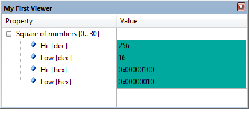

<b>Simple Example</b>

The following code creates a type called "MyGeneralType" that emulates the program structure \token{MyType} defined in
\em main.c. The object that is to be displayed searches for the symbol \em mysymbol and shows the items \em hi and \em low in
the viewer window:

**main.c File**

```
#include "RTE_Components.h"             // Component selection
#include CMSIS_device_header            // Device header
 
typedef struct {                        // type definition
  uint32_t hi;                          // offset 0
  uint32_t low;                         // offset 4
} MyType;
 
extern volatile MyType mysymbol;        // avoid compiler 6 warning
 
MyType volatile mysymbol;               // symbol definition
   
int main(void) {
  uint32_t  i;
 
  while (1) {
    for( i=0; i<=30; i++ ) {
      mysymbol.hi = i*i;
      mysymbol.low = i;
    }
  }
}
```

**Simple_View.scvd File**
```
<component_viewer schemaVersion="0.1" xmlns:xs="http://www.w3.org/2001/XMLSchema-instance" xs:noNamespaceSchemaLocation="Component_Viewer.xsd">
  <component name="MyFirstComponent" version="0.0.1"/>    <!-- name and version of the component  -->
 
  <typedefs>
    <typedef  name="MyGeneralType" info="This is MyType with 2 members" size="12">
      <member name="hi"   type="uint32_t"  offset="0"  info="member 'mysymbol.hi'"/>
      <member name="low"  type="uint32_t"  offset="4"  info="member 'mysymbol.low'"/>
    </typedef>
  </typedefs>
 
  <objects>
    <object name="MyFirstObject">
      <read name="MyFirstSymbol" type="MyGeneralType" symbol="mysymbol" const="0"/>
      
      <out name="My First Viewer">                                                        <!-- Window name -->
        <item property="Square of numbers [0..30]">                                       <!-- Property entry -->
                                                                                          <!-- These items extend the entry above -->
          <item property="Hi  [dec]"   value="%d[MyFirstSymbol.hi]"  info="Show decimal value of 'mysymbol.hi'"/>
          <item property="Low [dec]"   value="%d[MyFirstSymbol.low]" info="Show decimal value of 'mysymbol.low'"/>
          <item property="Hi  [hex]"   value="%x[MyFirstSymbol.hi]"  info="Show HEX value of 'mysymbol.hi'"/>
          <item property="Low [hex]"   value="%x[MyFirstSymbol.low]" info="Show HEX value of 'mysymbol.low'"/>
        </item>
      </out>
    </object>   
  </objects>
 
</component_viewer>
```

The Simple_View.scvd file has been added to the project as described in \manscvd.

**Build and run**

-# Open the project "Simple SCVD Example" from Pack Installer (search for \em uVision \em Simulator in the **Boards** tab).
-# Compile and run the application.
-# Open the window **View - Watch Windows - My First Viewer** and watch the values change while the program runs.

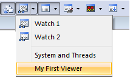

\page complex_scvd SCVD Complex Example

Use the example project **Complex SCVD Example** for more advanced topics.

This example is more complex than \ref simple_scvd and shows:
- The use of \ref scvd_expression and conditional computing for various XML elements
- The use of the built-in variable \token{_count}
- The use of \refelem{readlist} and \refelem{elem_listout,list} for looping through arrays

The example uses the structures \token{TypeA}, \token{TypeG}, and \token{TypeArray} defined in the project and creates a
static output showing initial member values and characteristics.

**main.c File**
 
```
#include "RTE_Components.h"             // Component selection
#include CMSIS_device_header
                         
// Type 'A' 
typedef struct TypeA {
  uint32_t                Nummer;
  uint32_t                Status;
  uint32_t                Size;
} TypeA;
 
// Type 'G' 
typedef struct TypeG {
  uint32_t                Nummer;
  uint32_t                Cluster;
  uint32_t                ClusterSize;
  uint32_t                Status;
} TypeG;
 
// Type Array 
typedef struct TypeArray {
  void   *type_ref;
  char    id[2];
  uint16_t attr;
} TypeArray;
 
static TypeA  type_a0 = { 0xA01, 0xA02, 0xA03 };
static TypeA  type_a1 = { 0xA11, 0xA12, 0xA13 };
static TypeG  type_g0 = { 0xF01, 0xF02, 0xF03, 0xF04 };
static TypeG  type_g1 = { 0xF11, 0xF12, 0xF13, 0xF14 };
static TypeG  type_g2 = { 0xF21, 0xF22, 0xF23, 0xF24 };
 
static int32_t x0;
 
extern TypeArray type_array[];
TypeArray type_array[] =  {
  { &x0,      "A0", 1 },
  { &type_g0, "G0", 2 },
  { &type_g1, "G1", 2 },
  { &type_a1, "A1", 1 },
  { &type_g2, "G2", 2 },
};
 
int main (void) {
   
  type_array[0].type_ref =  &type_a0;
  while (1) {
		__NOP();
  }
}
```

**Complex_view.scvd File**

```
<component_viewer schemaVersion="0.1" xmlns:xs="http://www.w3.org/2001/XMLSchema-instance" xs:noNamespaceSchemaLocation="Component_Viewer.xsd">
  <component name="MyView2" version="0.0.1"/>    <!-- name and version of the component  -->
 
  <typedefs>
    <typedef name="XML_TypeA"  size="12">
      <member name="Nummer"    type="uint32_t"          offset="0" />
      <member name="Status"    type="uint32_t"          offset="4" />
      <member name="Size"      type="uint32_t"          offset="8" />
    </typedef>
 
    <typedef name="XML_TypeG"  size="16">
      <member name="Nummer"      type="uint32_t"        offset="0" />
      <member name="Cluster"     type="uint32_t"        offset="4" />
      <member name="ClusterSize" type="uint32_t"        offset="8" />
      <member name="Status"      type="uint32_t"        offset="12" />
      <var    name="TotalSize"   type="uint64_t"        info="calculated as: Cluster*ClusterSize"/>
    </typedef>
    
    <typedef name="XML_TypeArray" size="8">  
      <member name="type_ref"  type="uint32_t"          offset="0"  info="Pointer to TypeA or TypeG" />
      <member name="id0"       type="uint8_t"  size="2" offset="4"  info="Type ID" />
      <member name="id1"       type="uint8_t"           offset="5"  info="Type ID" />  
      <member name="attr"      type="uint8_t"           offset="6"  info="Type Attribute"/>
      <var    name="idx"       type="uint32_t"                      info="calculated index in TypeX array" />
    </typedef>
  </typedefs>
 
  <objects>
    <object name="ListOfArrayTypes">
      <var name="i" type="int32_t" value="0" />               <!-- variable for loops -->
      <var name="j" type="int32_t" value="0" />               <!-- variable for loops -->
  
      <readlist name="TypeA"  type="XML_TypeA" />
      <readlist name="TypeG"  type="XML_TypeG" />  
      <readlist name="TArray" type="XML_TypeArray" symbol="type_array" count="5" />
 
      <list name="i" start="0" limit="TArray._count">         <!-- for(i=0;i<TArray._count;i++)  -->
        <calc cond="TArray[i].attr==1">   
            TArray[i].idx=TypeA._count;                       
        </calc>
        <readlist cond="TArray[i].attr==1"  name="TypeA"   type="XML_TypeA"  offset="TArray[i].type_ref" />
        
        <calc cond="TArray[i].attr==2">   
           TArray[i].idx=TypeG._count;   
        </calc>
        <readlist cond="TArray[i].attr==2"  name="TypeG"   type="XML_TypeG"  offset="TArray[i].type_ref" />
      </list>
           
      <list name="i" start="0" limit="TypeG._count">          <!-- for(;;)  -->
        <calc>   
           TypeG[i].TotalSize = TypeG[i].Cluster * TypeG[i].ClusterSize;   
        </calc>
            <calc>
                j=TArray._count;
            </calc>
      </list>
           
      <out name="Array and Structure Types">                    <!-- name of window and menu entry -->
        <!-- create output with two hierarchies -->
        <item property="Array Identifiers">                     <!-- the 'header' with sub entries -->
           <list name="i" start="0" limit="TArray._count">      <!-- for(;;) -->
             <item property="Data in TArray[%d[i]].id is:" value="%t[TArray[i].id0]" />
           </list>
        </item>
 
        <item property="" value="" />                            <!-- output empty line -->
 
        <!-- create output with two and three hierarchies -->
        <list name="i" start="0" limit="TArray._count">          <!-- for(;;)  -->
           <!-- two hierarchies for TypeA structure -->
           <item cond="TArray[i].attr==1" property="Type A%d[TArray[i].id1-0x30]:" value="Memory address (type_ref) = %x[TArray[i].type_ref]        idx=%d[TArray[i].idx]" > 
             <item property="Type A, size=%d[TypeA[TArray[i].idx].Size]" value="Num=%x[TypeA[TArray[i].idx].Nummer]      Status=%x[TypeA[TArray[i].idx].Status]" />
           </item>
           
           <!-- three hierarchies for TypeG structure -->
           <item cond="TArray[i].attr==2" property="Type G%d[TArray[i].id1-0x30]:" value="Memory address (type_ref) = %x[TArray[i].type_ref]        idx=%d[TArray[i].idx]" > 
             <item property="Type G, Total size=%d[TypeG[TArray[i].idx].TotalSize]" value="Num=%x[TypeG[TArray[i].idx].Nummer]      Status=%x[TypeG[TArray[i].idx].Status]" >
               <item property="Cluster" value="n=%x[TypeG[TArray[i].idx].Cluster]             Size=%x[TypeG[TArray[i].idx].ClusterSize]" />
             </item>
           </item>
        </list>
  
        <item property="" value="------ Types ------" />         <!-- output line with empty property but text in 'Value' column -->
                 
        <list name="i" start="0" limit="TypeA._count">         <!-- for(i=0;i<_count;i++)  -->
          <item property="Type A%d[i]" value="Num=%x[TypeA[i].Nummer], Size=%x[TypeA[i].Size]" />
        </list>
  
        <list name="i" start="0" limit="TypeG._count">  
          <item property="Type G%d[i]" value="Num=%x[TypeG[i].Nummer], Total size=%x[TypeG[i].TotalSize]" />
        </list>
  
      </out>
    </object>
  </objects>
</component_viewer>
```

**Build and run**

-# Open the project "Complex SCVD Example" from Pack Installer (search for \em uVision \em Simulator in the **Boards** tab).
-# Compile and run the application
-# Open the window **View - Watch Windows - Array and Structure Types** and verify the output

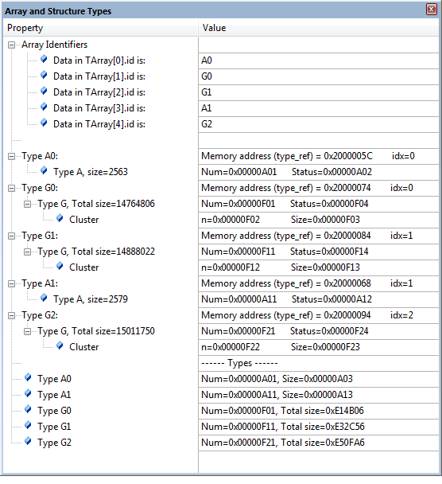

\page MyComponent SCVD in MyComponent

MyComponent implements a data transfer using the functions \c MyComp_initialize, \c MyComp_send, and \c MyComp_receive.
During operation, the component calls event functions that provide event data for recording by the Event Recorder.

This example shows how to:
  - \ref add_event_annotations "add event annotations" to a software component
  - \ref create_scvd "create an SCVD file" for status and event displays in the MDK debugger
  - \ref create_doxy "create Doxygen documentation" that utilizes the MDK context help system
  - \ref create_pack "create a software pack" using the CMSIS-Pack standard

  
# Add Event Annotations {#add_event_annotations}

It is possible to add \ref Event_Annotations pragmatical as explained in the section \ref er_use. However, for more complex
software components, it makes sense to use a structured approach as described in the following.

Event annotation should deliver meaningful information about the dynamic execution of a software component and can be grouped
into the following categories using level information in the \ref EventID.
  - \ref EventLevelError indicates when an event relates to run-time errors in the component.
  - \ref EventLevelAPI should be used when an event relates to API function calls.
  - \ref EventLevelOp refers to events that related to internal operations.
  - \ref EventLevelDetail allows to provided events with additional detailed information of operations.

Instead of using the general purpose \ref EventRecorder_Data functions, specify component specific functions that can be
tagged with an \ref EventID. These component specific functions are calling then the \ref EventRecorder_Data functions.
  
The event recorder functions for the MyComponent software component are using severity level information in their
\ref EventID "EventIDs" (refer to the file EvrMyComponent.h in the example project):

```
#define EvtMyCo_No 0x0A     /// < Number of the component with short name 'EvtMyCo_No'
 
// Event id list for "MyComponent"
#define EvtMyCo_InitEntry         EventID (EventLevelAPI,   EvtMyCo_No, 0x00)
#define EvtMyCo_InitStatus        EventID (EventLevelAPI,   EvtMyCo_No, 0x01)
#define EvtMyCo_SendNoData        EventID (EventLevelError, EvtMyCo_No, 0x0A)
#define EvtMyCo_SendComplete      EventID (EventLevelOp,    EvtMyCo_No, 0x0B)
#define EvtMyCo_SendFailed        EventID (EventLevelError, EvtMyCo_No, 0x0C)
#define EvtMyCo_ReceiveNoData     EventID (EventLevelError, EvtMyCo_No, 0x15)
#define EvtMyCo_ReceiveComplete   EventID (EventLevelAPI,   EvtMyCo_No, 0x16)
#define EvtMyCo_ReceiveFailed     EventID (EventLevelError, EvtMyCo_No, 0x17)
```
  
The \ref EventID also contains information about the component number (to identify the event) and the specific message number
that is used to display additional information in the Event Recorder window.


# Create an SCVD file {#create_scvd}

The SCVD file for MyComponent uses this message number information to display the correct messages in Event Recorder.

```
<!-- event list for MyComponent -->
    <events>	 
      <group>
        <component name="MyComponent"  brief="MyCo"    no="0x0A"  prefix="EvrMyCo_"     info="My Component - Demo example"/>
      </group>
      <event id="0xA00" level="API"    property="InitEntry"                             info="Event on MyComp_initialize start"/>
      <event id="0xA01" level="API"    property="InitStatus"                            info="Event on MyComp_initialize return"/>
      <event id="0xA0A" level="Error"  property="SendNoData"                            info="Event on MyComp_initialize return"/>
      <event id="0xA0B" level="Op"     property="SendComplete"    value="size=%d[val1]" info="Event on MyComp_send - completed"/>
      <event id="0xA0C" level="Error"  property="SendFailed"      value=""              info="Event on MyComp_send - send failed"/>
      <event id="0xA15" level="Error"  property="ReceiveNoData"   value=""              info="Event on MyComp_receive - no data received"/>
      <event id="0xA16" level="Op"     property="ReceiveComplete" value="size=%d[val1]" info="Event on MyComp_receive - completed"/>
      <event id="0xA17" level="Error"  property="ReceiveFailed"   value=""              info="Event on MyComp_receive - receive failed"/>
	</events>
```

<br/>

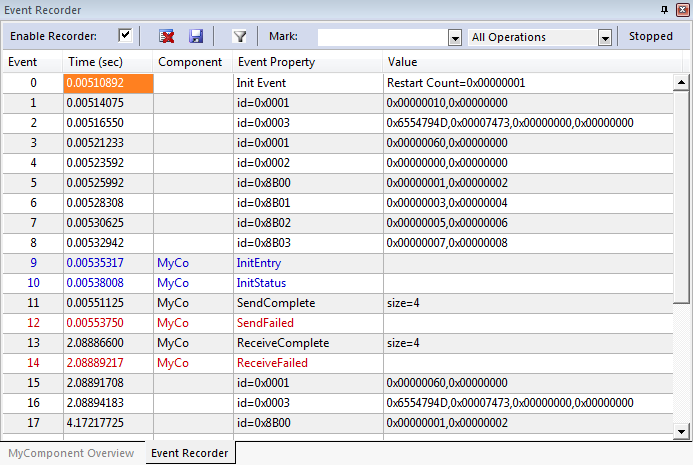

# Generate documentation {#create_doxy}

Software components are frequently a black-box to the application programmer and event annotations need additional
descriptions that interlinks with API related documentation.

<a href="http://www.stack.nl/~dimitri/doxygen/">Doxygen</a> is frequently used to generate API documentation. Using this
approach, event annotations can be documented in a similar way. Once the software component is framed as a
\ref create_pack "CMSIS-Pack", the documentation for event annotations opens using hyperlinks in the Event Recorder.

A full documentation of the software component is available in the software pack that is built in the next step. You will
find the Doxygen source code in ./SCVD_Examples/MyComponent/Doxygen. Run the script \c gen_doc.bat to create the
documentation.

# Create a pack {#create_pack}

<a href="https://arm-software.github.io/CMSIS_5/Pack/html/index.html">CMSIS-Pack</a> describes a mechanism to deliver
software components, device parameters, and evaluation board support. The XML-based package description file (PDSC) describes
the content of a software pack (file collection) that may include:
 - Source code, header files, and software libraries
 - Documentation and source code templates
 - Device parameters along with startup code and programming algorithms
 - Example projects

For the software component "MyComponent", as pack is available in the directory ./SCVD_Examples/MyComponent_Pack.
Double-click MyVendor.MyComponent.1.0.0.pack to install it on your system. It contains one software component called
:MyVendor:MyComponent with related documentation.

\image html mycomponent.png "MyComponent in the Manage Run-time Environment window"

The PDSC file is very simple. It declares a single software component that comes with source files, SCVD and HTML
documentation:
```
    <component Cclass="MyVendor" Cgroup="MyComponent" Cversion="1.0.0" condition="Cortex-M Device">
      <description>MyComponent software component example</description>
      <files>
        <file category="header" name="Source/MyComponent.h"/>
        <file category="source" name="Source/MyComponent.c"/>
        <file category="doc"    name="html/index.html"/>
        <file category="other"  name="Source/MyComponent.scvd"/>
      </files>
    </component>
```

An example project called "MyComponent Pack Example" is also part of the pack. It is basically the same example as
\ref MyComponent, only that it is using the "MyComponent" software component.

If you build and run the example, you will see that the events that are recorded now contain hyperlinks that bring up the
related documentation.

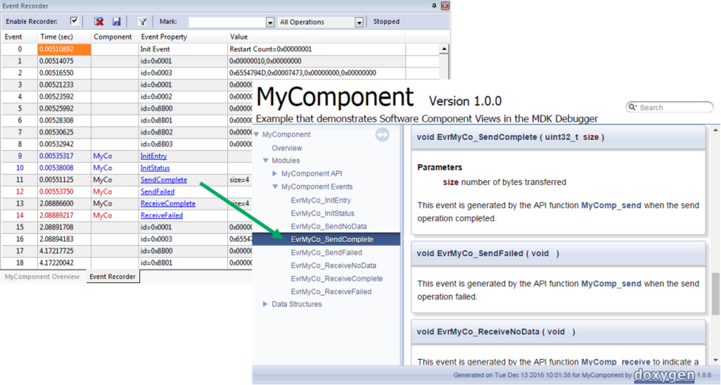

With this, you can create re-usable software components that can be equipped with Event Recorder
information and related documentation. This is useful if you intend to share the software component within your company or
with third parties.

\page scvd_evt_stat SCVD Event Statistics

This example project shows how to use start/stop events with the Event Recorder.  For further details refer to \ref es_use.

The start/stop events allow to measure execution times with different slots (0 - 15) in four different groups (A - D). The
call to 'EventStart' starts a timer slot; the call to 'EventStop' stops the related timer.  A call to EventStop with slot 15 
stops the timers of all slots in the specific group.

This demo application does some time consuming calculations that are recorded. It runs in simulation and does not require any
hardware to be present.

**main.c File**

```
#include "RTE_Components.h"
#include  CMSIS_device_header
 
#ifndef RTE_Compiler_EventRecorder
#warning This example requires the Event Recorder component
#endif
 
#include "EventRecorder.h"
#include <math.h>
#include <stdlib.h>
 
#define TABLE_SIZE 1000
float sin_table[TABLE_SIZE];
 
// Calculate table with sine values 
void CalcSinTable (void)  {
  unsigned int i, max_i;
  float f = 0.0;
  
  max_i = TABLE_SIZE - (rand () % 500);
  EventStartAv (15, max_i, 0);                  // Start group A, slot 15, passing the max_i variable
  for (i = 0; i < max_i; i++)  {
    if (i == 200)  {
       EventStartAv (0, max_i, 0);              // Start group A, slot 0, passing the max_i variable
    }
 
    sin_table[i] = sinf(f);
    f = f + (3.141592 / TABLE_SIZE);
  
    if (i == 800)  {                            // Measure 800 table entries
      EventStopA (0);                           // Stop group A, slot 0
    }
  }
 
  EventStopA (15);                              // Stop group A, slot 15 (stops also slots 0..14)
}
 
// Return number of sqrt operations to exceed sum
unsigned int FindSqrtSum (float max_sum)  {
  unsigned int i;
  float sqrt_sum;
   
  sqrt_sum = 0.0;
  for (i = 0; i < 10000; i++) {
    sqrt_sum += sqrtf((float) i);
    if (sqrt_sum > max_sum)  {
      return (i);
    }
  }
  return (i);
}
 
unsigned int j, num, MaxSqrtSum;
 
int main (void) {
 
  SystemCoreClockUpdate();                      // System Initialization
  
  EventRecorderInitialize(EventRecordAll, 1U);  // Initialize and start Event Recorder
 
  EventStartC (0);                              // start measurement event group C, slot 0
 
  for (j = 0; j < 1000; j++)  {
    CalcSinTable ();                            // calculate table with sinus values
  
    EventStartB(0);                             // start group B, slot 0
    MaxSqrtSum = rand () / 65536;               // limit for sqrt calculation
    num = FindSqrtSum ((float) MaxSqrtSum);     // return number of sqrt operations
    EventStopBv(0, MaxSqrtSum, num);            // stop group B, slot 0, output values: MaxSqrtSum, num
  }
 
  EventStopC(0);                                // stop measurement event group C, slot 0
  
  for (;;) {}
}
```

**Build and run**

-# Open the project "SCVD Event Statistic" from Pack Installer (search for \em uVision \em Simulator in the **Boards** tab).
-# Compile and run the application.
-# Open the windows <b>View - Analysis Windows - \erecorder</b> and <b>View - Analysis Windows - \estatistics</b> to verify the output.

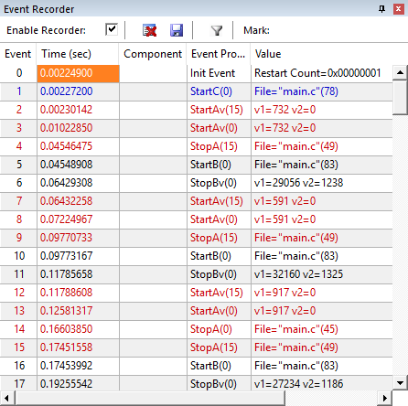

<br/>

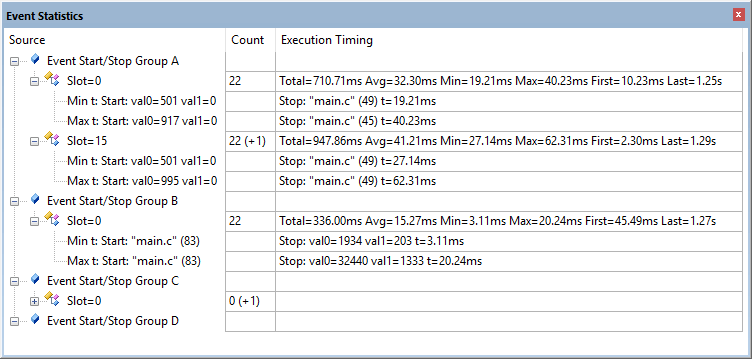

\page scvd_evt_state SCVD Event State

This example project shows how to display state information with the Event Recorder.
The application itself implements a event_state thread that is started with two instances.
The event state thread itself makes state transitions that are recorded.

**Source code of the event state thread (from MyEventComponent.c)**
```
void event_state (void *argument) {
  unsigned int i, h, name;
  
  name = (unsigned int) argument;
  h = name + 0x10000000;
  
  osDelay(100);
  EvrMyC1_Create (h, name);
  for (i=0; i < 2; i++)  {
    osDelay(100);
    EvrMyC1_Active (h);
    osDelay(100);
    EvrMyC1_Waiting (h);
    osDelay(100);
    EvrMyC1_Idle (h);
    osDelay(100);
  }
  
  EvrMyC1_Clear (h);
  osDelay(100);
  EvrMyC1_Delete (h);
  :
}
```

**Start of the event state thread (from main.c)**

```
char *name1 = "MyName1";
char *name2 = "MyName2";

osThreadId_t event_state1_id;
osThreadId_t event_state2_id;

int main (void) {

  EventRecorderInitialize (EventRecordAll, 1);  // initialize and start Event Recorder

  osKernelInitialize();                         // initialize CMSIS-RTOS
  event_state1_id = osThreadNew(event_state, name1 /* "Instance 1" */, NULL);
  event_state2_id = osThreadNew(event_state, name2 /* "Instance 2" */, NULL);
  osKernelStart ();
}
```

The application itself uses the MyEventComponent.scvd file to describe the state. Refer to the element \refelem{elem_group_component_state,state} for more information.


**Build and run**

-# Open the project "SCVD Event State" from Pack Installer (search for \em uVision \em Simulator in the **Boards** tab).
-# Compile and run the application.
-# Open the windows <b>View - Analysis Windows - \erecorder</b> and <b>View - Analysis Windows - </b><a target="_blank" href="http://www.keil.com/support/man/docs/uv4/uv4_db_dbg_systemanalyzer.htm"><b>System Analyzer</b></a> to verify the output.

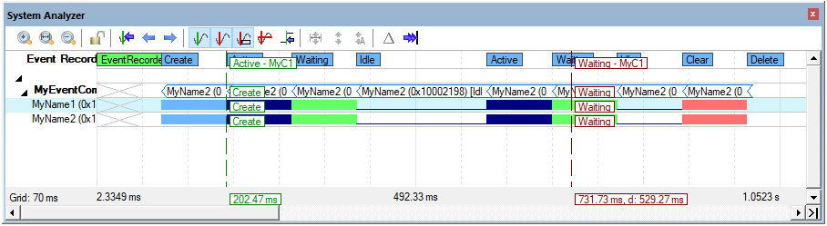

<br/>

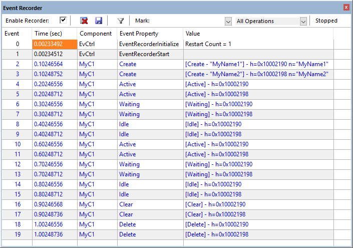

\page scvd_CM0_SysTick SCVD Cortex-M0 SysTick

This example projects shows the Event Recorder with SysTick timer as time source (for Cortex-M0/M0+/M23).
Refer to \ref noDWT "Configure for targets without DWT Cycle Counter" for more information.

**Build and run**

-# Open the project "SCVD Cortex-M0 SysTick" from Pack Installer (search for *uVision Simulator* in the **Boards** tab).
-# Compile and run the application.
-# Open the windows <b>View - Analysis Windows - \erecorder</b> to verify the output.

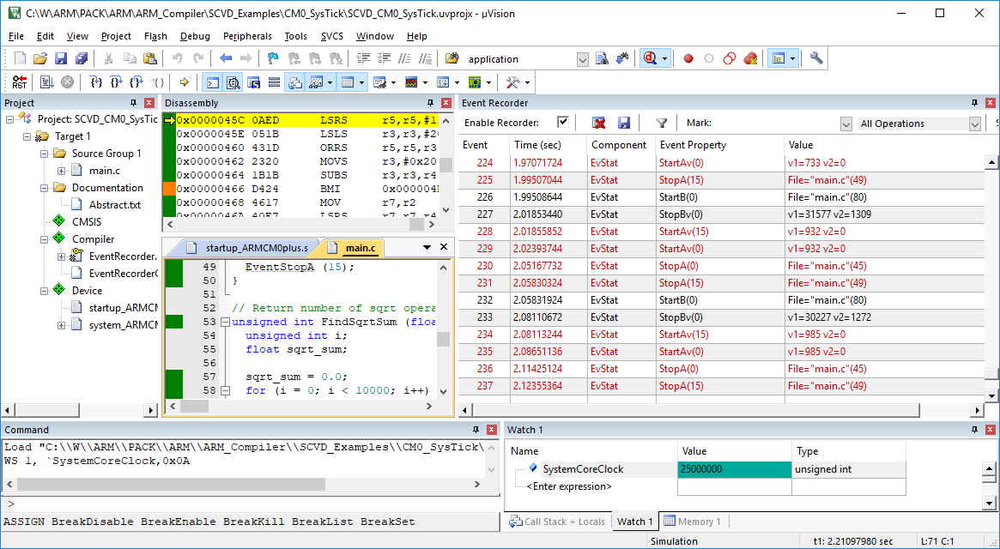

\page scvd_CM0_RTOS SCVD Cortex-M0 RTOS

This example projects shows the Event Recorder with CMSIS-RTOS2 System Timer as time source (for Cortex-M0/M0+/M23).
Refer to \ref noDWT "Configure for targets without DWT Cycle Counter" for more information.

**Build and run**

-# Open the project "SCVD Cortex-M0 RTOS" from Pack Installer (search for \em uVision \em Simulator in the **Boards** tab).
-# Compile and run the application.
-# Open the windows <b>View - Analysis Windows - \erecorder</b> and <b>View - Analysis Windows - </b><a target="_blank" href="http://www.keil.com/support/man/docs/uv4/uv4_db_dbg_systemanalyzer.htm"><b>System Analyzer</b></a> to verify the output.

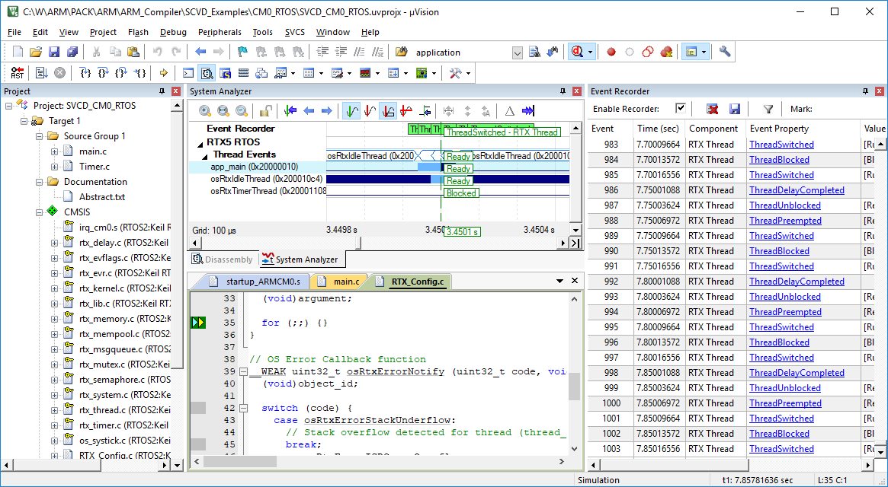
